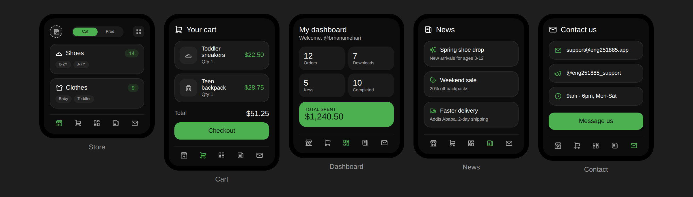
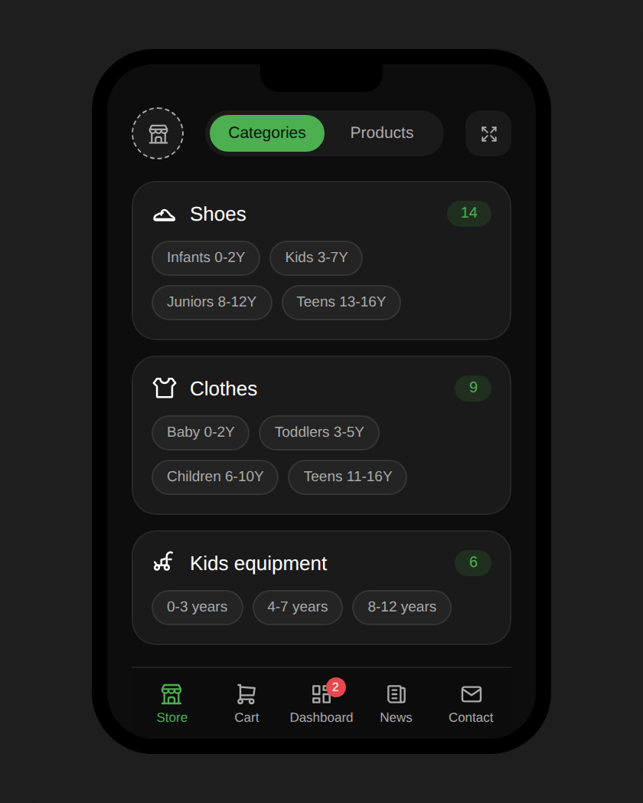

# ENG_251885 APP — Telegram Mini Kids Store

A production-ready Telegram Mini App (TMA) for a kids store, built with a vanilla JS frontend, a secure PHP/MySQL backend, and a unified payment router covering Ethiopian and international gateways.

**Repo:** [github.com/brhanumehari/Telegram-mini-kids-store](https://github.com/brhanumehari/Telegram-mini-kids-store)

---

## ✨ Features

- **Store Home** — Three category groups (Shoes, Clothes, Kids Equipment), each with four age-range sub-tags and a live product counter.
- **Products Grid** — Live search, age-bucket filtering, and an "Add to Cart" flow on a responsive 2-column masonry grid.
- **Customer Dashboard** — Profile summary pulled from the native Telegram handle, a 2×2 stats matrix (Orders / Downloads / Keys / Completed), a total-spend banner, and tabbed order history.
- **Unified Payment Router** — One abstraction layer with adapters for:
  - 🇪🇹 Telebirr, Commercial Bank of Ethiopia (CBE Birr), Dashen Bank (Amole), Awash Bank
  - 🌍 PayPal (REST Orders v2), Mastercard Payment Gateway Services (MPGS)
  - ⭐ Telegram Stars (native Bot API invoices)
- **Security** — 100% PDO prepared statements, Telegram `initData` HMAC-SHA256 verification, per-provider webhook signature checks, transactional stock locking on checkout, and generic error responses (no internal details leaked).
- **Design System** — Cyber-Minimalist dark theme (`#0D0D0D` background, `#4CAF50` neon-green accent, 12–16px radii, Inter/SF Pro typography).

---

## 📱 Screenshots

**All five screens** — Store, Cart, Dashboard, News, Contact:



**Store Home** — category groups with age sub-tags and live product counts:



---

## 🗂 Project Structure

```
.
├── index.html              # SPA shell + embedded CSS design tokens
├── app.js                  # Frontend logic: routing, cart, API calls, Telegram WebApp SDK
├── api.php                 # JSON API: categories, products, dashboard, orders, checkout
├── PaymentRouter.php       # Payment gateway adapters + webhook handler
├── config.php              # Environment-driven configuration (DB + provider credentials)
├── schema.sql              # MySQL DDL + seed data for categories/sub-tags
├── lib/
│   └── TelegramAuth.php    # Telegram initData HMAC verification
├── screenshots/
│   ├── all-screens-overview.png   # Store, Cart, Dashboard, News, Contact
│   └── store-home.png             # Store Home detail view
└── README.md
```

---

## ✅ Prerequisites

- PHP 8.1+ with `pdo_mysql` and `curl` extensions enabled
- MySQL 8.0+ (or MariaDB 10.6+)
- A Telegram Bot created via [@BotFather](https://t.me/BotFather), with a Mini App configured (`/newapp`)
- HTTPS hosting (Telegram Mini Apps require a valid TLS certificate — no `http://`)
- Merchant credentials for whichever payment providers you intend to enable

---

## 🚀 Getting Started

### 1. Clone the repo

```bash
git clone https://github.com/brhanumehari/Telegram-mini-kids-store.git
cd Telegram-mini-kids-store
```

### 2. Create the database

```bash
mysql -u root -p < schema.sql
```

This creates the `eng251885_kidstore` database, all six tables (`users`, `categories`, `products`, `orders`, `order_items`, `admins`), and seeds the three top-level categories with their twelve age sub-tags.

### 3. Configure environment variables

`config.php` reads everything from the environment — nothing is hard-coded. Set these on your host (Apache `SetEnv`, nginx `fastcgi_param`, systemd `Environment=`, or your platform's secrets manager):

| Variable | Required | Description |
|---|---|---|
| `DB_HOST`, `DB_PORT`, `DB_NAME`, `DB_USER`, `DB_PASS` | ✅ | MySQL connection |
| `TELEGRAM_BOT_TOKEN` | ✅ | Bot token from BotFather — used to verify `initData` |
| `TELEBIRR_APP_ID`, `TELEBIRR_APP_KEY`, `TELEBIRR_SHORT_CODE`, `TELEBIRR_PUBLIC_KEY`, `TELEBIRR_NOTIFY_URL` | optional | Required only if Telebirr is enabled |
| `CBE_MERCHANT_ID`, `CBE_API_KEY`, `CBE_API_BASE` | optional | Required only if CBE Birr is enabled |
| `DASHEN_MERCHANT_ID`, `DASHEN_API_KEY`, `DASHEN_API_BASE` | optional | Required only if Dashen/Amole is enabled |
| `AWASH_MERCHANT_ID`, `AWASH_API_KEY`, `AWASH_API_BASE` | optional | Required only if Awash Birr is enabled |
| `PAYPAL_CLIENT_ID`, `PAYPAL_CLIENT_SECRET`, `PAYPAL_ENV` (`live`/`sandbox`) | optional | Required only if PayPal is enabled |
| `MPGS_MERCHANT_ID`, `MPGS_API_PASSWORD`, `MPGS_API_BASE` | optional | Required only if Mastercard MPGS is enabled |

A provider that isn't configured simply throws a clear "not configured" error at checkout time instead of failing silently.

### 4. Point your web server at the project root

Any PHP-capable host works (Apache, nginx + php-fpm, or for local testing):

```bash
php -S 0.0.0.0:8080
```

### 5. Register the Mini App URL with BotFather

In BotFather: `/newapp` → select your bot → set the Web App URL to your deployed `index.html` (e.g. `https://yourdomain.com/`).

### 6. Configure payment webhooks

Each bank/PSP needs its callback URL pointed at:

```
https://yourdomain.com/PaymentRouter.php?provider={telebirr|cbe_birr|dashen_amole|awash_birr|paypal|mastercard}
```

`PaymentRouter.php` verifies the inbound signature, resolves the order from the merchant reference, and atomically updates `orders.payment_status` plus the customer's running `total_spent`.

---

## ⚠️ Before Going Live

The Ethiopian bank adapters (Telebirr, CBE, Dashen/Amole, Awash) are wired against each provider's general REST conventions, but the **exact field names are issued under merchant NDA** and vary by bank. Search `PaymentRouter.php` for `// TODO` comments and replace the request payloads with the exact schema from your merchant onboarding packet before processing real transactions.

Telegram Stars checkout currently signals `type: 'telegram_invoice'` from `PaymentRouter::createCheckout()` — wire this up to your bot server's `sendInvoice` (currency `XTR`) and `answerPreCheckoutQuery` handlers to issue a real invoice link for `Telegram.WebApp.openInvoice()`.

---

## 🔒 Security Notes

- All SQL is parameterized via PDO — no string-concatenated queries anywhere.
- `initData` is verified with `hash_equals()` against an HMAC-SHA256 computed from the bot token, per Telegram's official spec, and rejected if older than 24 hours.
- Every payment webhook adapter independently verifies its provider's signature before any database write occurs.
- Stock decrements happen inside a `SELECT ... FOR UPDATE` transaction to prevent overselling under concurrent checkouts.
- `display_errors` is off by default; all exceptions are logged server-side and returned to clients as generic messages.

---

## 📄 License

Proprietary — all rights reserved unless otherwise licensed by the author.

---

## 👤 Author

**ENG_251885** — Mechanical Engineer & Full-Stack Developer
